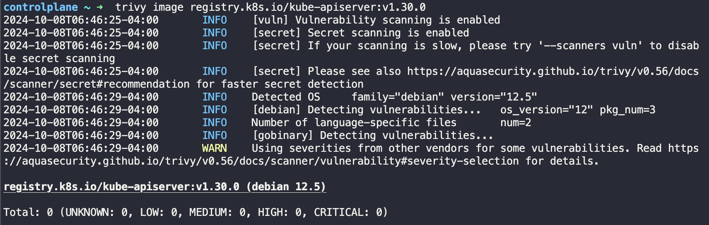
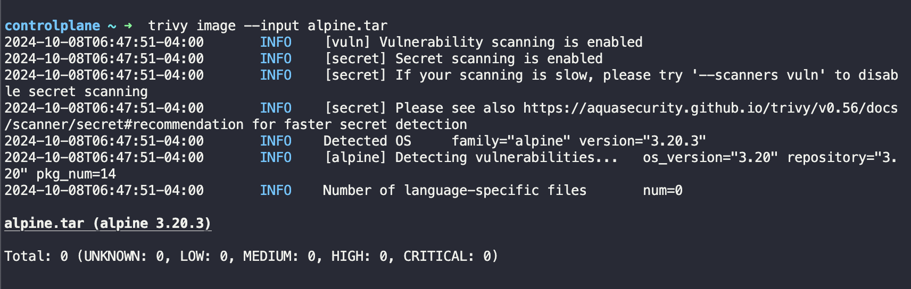

# Compromised image In registry
A compromised container image in a trusted registry can be used to gain initial access to a Kubernetes cluster if you're able to push images to it. This attack path is fundamentally the same concept as [Persistence -> Backdoor_container](http://localhost:3000/Persistence/Backdoor_container.html).

A compromised image in a container registry is the logical next step to [Persistence -> Backdoor_container](http://localhost:3000/Persistence/Backdoor_container.html). If an attacker is able to upload or tamper with the "trusted" images in a registry such as [Harbor](https://github.com/goharbor/harbor), they can fully control the environment the application is operating within. This is analogous downloading an ubuntu ISO that an attacker had tampered with and using it as your base operating system.


# Attacking
This attack picks up where [Persistence -> Backdoor Container](../Persistence/Backdoor_container.md) left off. The prerequisites for this attack are:
1. You are able to upload images to a container registry.
2. You know the container image name that will be pulled
3. You have created a backdoor image (see [Persistence -> Backdoor Container](../Persistence/Backdoor_container.md))

First, lets login to the container registry using `docker login <registry_url> -u <username>`. Next, ensure that your backdoored image is available by running `docker image ls | grep <image_name>`. 

Now we have to `tag` the image. `docker tag <image_to_tag> <registry_url>/REPOSITORY/IMAGE_NAME`

Finally, push the backdoored image by running `docker push <registry_url>/REPOSITORY/IMAGE_NAME`. 


After that, the image will be pushed to the container registry. Assuming the image is pulled by Kubernetes, your backdoored image will be deployed.


# Defending

Threat actors rely on you to pull the image and deploy it in your cluster or to even just run it. The aim for them would be to then use its backdoor to break out and hope to get into the wider cluster causing havoc. 

A strategy to mitigate a compromised image in your registry would be to scan your images before deploying them into your environment. This can be achieved by a scan of the image using Trivy. 

Trivy detects vulnerabilities and outputs to the screen the total number of vulnerabilities, scored from `LOW`, `MEDIUM`, `HIGH` and `CRITICAL`. 

First, install the `trivy` vulnerability scanner on host — refer to the aqua trivy documentation: [https://aquasecurity.github.io/trivy-repo/](https://aquasecurity.github.io/trivy-repo/deb/public.key). 

`#Update Repo and Install trivy
apt-get update
apt-get install trivy`

Next, run the command `trivy image <image-name:name>` or `trivy image --input /path/to/<file-name>.tar`

Note: If you’re scanning a tar file, be sure to have it downloaded locally such that you could reference it. 



In the Figure above we scan the kube-apiservers image.



In the Figure above we scan a tar file, from an alpine image we found.

You could also scan an unpacked container image filesystem. 

```bash
# First export the image as an unpacked container filesystem:
`docker export $(docker create alpine:3.10.2) | tar -C /tmp/rootfs -xvf -`
# Then run the scan 
`trivy fs /tmp/rootfs`
```

Vulnerability scanning tools are among other defensive mechanisms, would allow one to have visibility into the exact severity of the vulnerability that a malicious image may have, such as backdoors or unrelated malicious packages thus allowing one to understand deeper the latest nuanced attack vectors threat actors are utilising.

As a bonus I’ll share a very basic shell script that can be stored within the bash.rc file to make scanning even easier for your team.
😉
As a pre-requisite, you need to have trivy installed as a package -- refer back to the docs referenced above. 

```bash
`#!/bin/bash`

# Presenting the options to the admin on what they would like to scan
echo "1. Image"
echo "2. Tar File"
echo "3. Repsoitory"
echo "4. File system"
read -p "Select one of the 4 options: " op
# Based on the option the user has chosen. We present then with the prompt to provide the parameter to what they would like to scan.i
if [ $op -eq 1 ]
then
read -p "Enter image name: " image
trivy image $image
elif [ $op -eq 2 ]
then
read -p "Enter path to tar file: " tar
trivy image -input $tar
elif [ $op -eq 3 ]
then
read -p "Enter repository URL: " repo
trivy repo $repo
elif [ $op -eq 4 ]
then
read -p "Enter path to unpacked container image filesystem: " fs
trivy fs $fs
fi`
```

